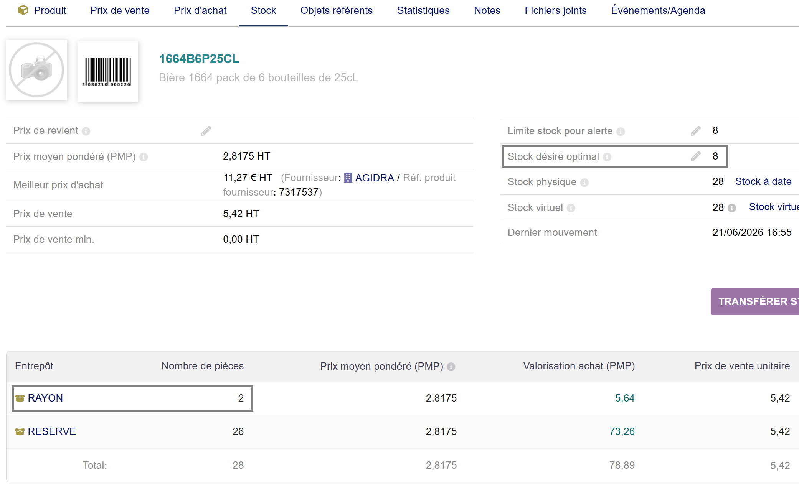
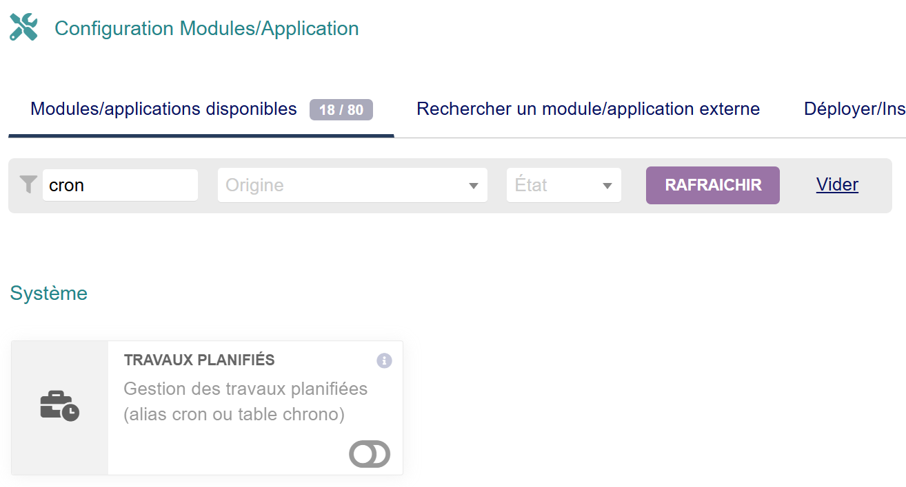
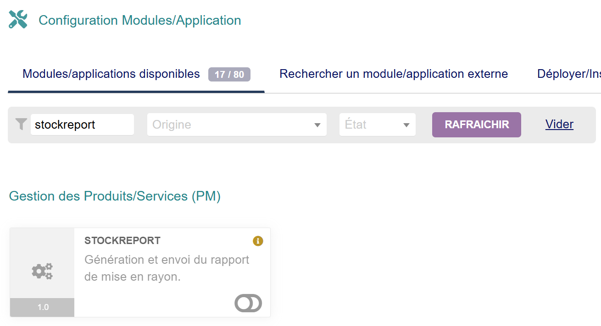
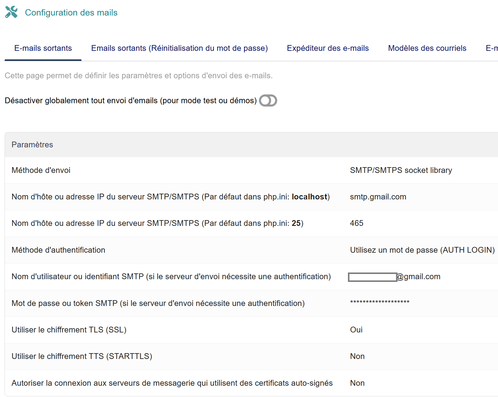
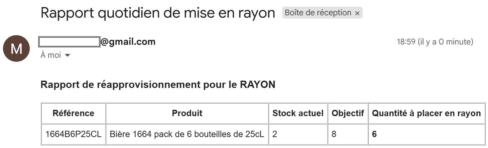

# Module StockReport pour Dolibarr

## Description
**StockReport** est un module d'extension pour Dolibarr ERP/CRM. Il automatise la génération et l'envoi d'un rapport quotidien par e-mail listant les produits nécessitant un réapprovisionnement physique vers l'entrepôt "RAYON". 

Le traitement identifie le delta entre le stock physique actuel dans le rayon et le stock désiré défini sur la fiche produit.

## Prérequis
* **Environnement** : Dolibarr ERP/CRM (testé sous la version 22.0.4).
* **Configuration E-mail** : Serveur SMTP fonctionnel configuré dans *Configuration > E-mails*.
* **Modules natifs requis** : Travaux planifiés (Cron) activé.

## Installation
1. Copiez ou clonez le dossier du module dans le répertoire `htdocs/custom/stockreport/` de votre arborescence Dolibarr.
2. Assurez-vous que l'utilisation du répertoire `custom` est activée dans votre fichier `htdocs/conf/conf.php` (lignes `$dolibarr_main_url_root_alt` et `$dolibarr_main_document_root_alt` décommentées).
3. Connectez-vous à Dolibarr avec un compte disposant des droits d'administration.
4. Rendez-vous dans **Accueil > Configuration > Modules/Applications**.
5. Cherchez **StockReport** dans la liste et cliquez sur l'interrupteur pour l'activer.

## Architecture technique et Fonctionnement
* **Initialisation** : À l'activation, le descripteur de module (`modStockReport.class.php`) enregistre automatiquement une tâche planifiée nommée `RapportMiseEnRayon`, configurée pour une exécution toutes les 24 heures.
* **Extraction des données** : Le script métier (`class/stockreport.class.php`) interroge les tables `llx_product`, `llx_product_stock` et `llx_entrepot` via une requête SQL pour isoler les références dont le stock en rayon est inférieur au stock minimum.
* **Notification** : Le système formate le résultat en tableau HTML et l'expédie au gestionnaire via la classe interne Dolibarr `CMailFile`.

## Captures d'écran

### Exemple de produit à réaprovisionner

### Modules à activer

### Exemple de configuration e-mail

### Rapport final
